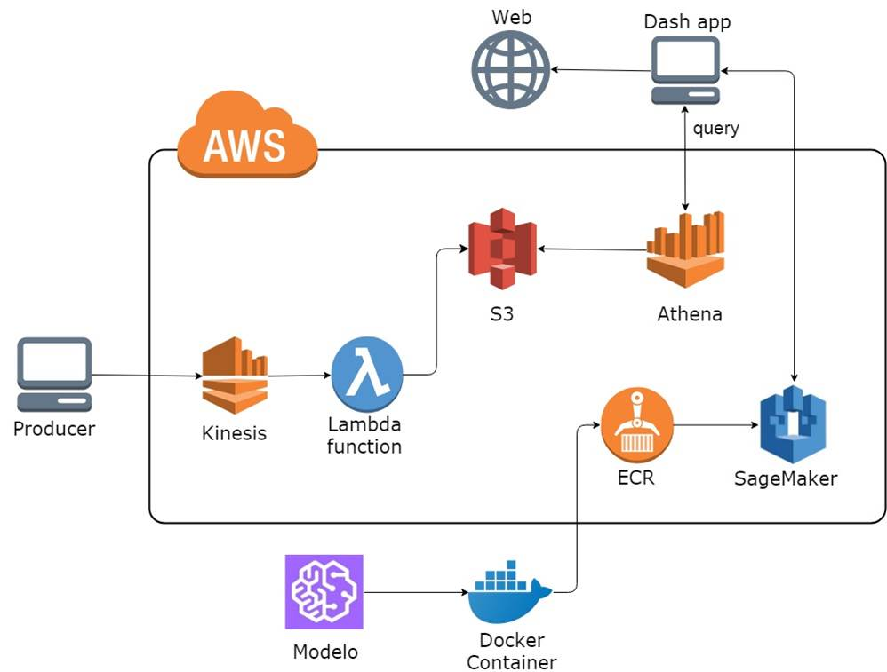
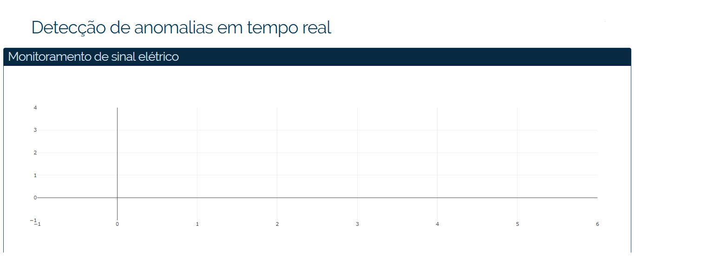

# deploy_completo_AWS

Esse script contem o deployment de um modelo de Deep Learning (LSTM) para detectar anomalias em sinais de eletrocardiogramas. A inferencia acontece online e os resultados, assim como o sinal, são plotados em um grfico em tempo real. 

## Arquitetura

A arquitetura do projeto pode ser vista na imagem abaixo:

### Deployment do modelo
* O modelo (nesse caso uma LSTM) é produzido e testado localmente em um container
* O container é enviado para o ECR
* o SageMaker utiliza esse container para disponibilizar a API do modelo

### Fluxo dos dados
* Um producer (que simula um dispositivo de medição) envia medições para uma fila Kinesis
* Uma LambdaFunction associada à essa fila Kinesis é disparada e salva os dados no S3
* O grafico em tempo real Dash faz uma query no Athena, vinculado ao S3
* O mesmo Dash app faz uma requisição Para o SageMaker, utilizado os dados da Query

--------------------------------------------------------------------------------------

## Passos

### 1. Download Docker (OS Windows)
- Windows 10: [click here](https://store.docker.com/editions/community/docker-ce-desktop-windows)
- Windows 7: [click here](https://docs.docker.com/toolbox/toolbox_install_windows/), video de apoio [click here](https://www.youtube.com/watch?v=cLE7ewk8HWU )

**`OBS: Se estiver usando o windows 7 com Docker Tool box, coloque a pasta padrão em C:/Users/`**

### 2. Configurar o container
- colocar o modelo em: `container\local_test\test_dir\model`
- O arquivo `Dockerfile` contém informações das bibliotecas que serão instaladas e outras informações

### 3. Contruir a Imagem docker
- Abra o Docker Tool box 
- Vá até a pasta onde se encontra a DOCKERFILE
- docker build -t xgboost-tut . (com o ponto no final)
- Para encontrar o ip do container: `docker-machine ip default`

### 4. Testar o modelo localmente
- Para servir o modelo localmente: `docker run --rm --network=host –v $(pwd)/local_test/test_dir:/opt/ml aws-teste serve_local`
- Para fazer a inferencia - entrar na pasta local_test: `predict_local.sh 192.168.99.100:8080 payload.csv text/csv`

### 5. AWS ECR
- Com a CLI da AWS baixada, configurar sua conta com `aws configure`
- Credencias para ECR: `aws ecr get-login --no-include-email --region <region>`
- rodar o arquivo `build_and_push.sh  <nome_da_imagem>`
- A imagem deve aparecer no amazon ECR

### 6. AWS SageMaker
- Criar um modelo SageMaker
- Em `Primary container`, na seção `Location of inference code image`, colocar a URL disponibilizada pelo ECR
- Será necessário criar o EndPoint.
- O modelo será disponibilizado e o nome do endpoint deve ser colocado no arquivo `web_graph.py`

### 7. AWS Athena
- Será necessário configurar o AWS athena para ler a tabela formada pelos arquivos .txt do bucket que escolher.
- Configurar os parâmetros do aruivo `query_athena.py`

### 8. Operacionalização
- Rodar `web_graph.py`
- Rodar `producer.py`

No caminho especidicado pelo `web_graph.py`, em uma aba do navegador aparecerá:

O grafico começara a ser atualizado.

