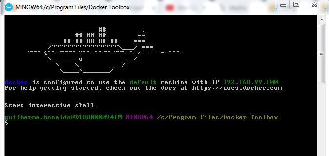

# deploy_completo_AWS

## Arquitetura

A arquitetura do projeto pode ser vista na imagem abaixo:

### Deployment do modelo
* O modelo (nesse caso uma LSTM) é produzido e testado localmente em um container
* O container é enviado para o ECR
* o SageMaker utiliza esse container para disponibilizar a API do modelo

### Fluxo dos dados
* Um producer (que simula um dispositivo de medição) envia medições para uma fila Kinesis
* Uma LambdaFunction associada à essa fila Kinesis é disparada e salva os dados no S3
* O grafico em tempo real Dash faz uma query no Athena, vinculado ao S3
* O mesmo Dash app faz uma requisição Para o SageMaker, utilizado os dados da Query

--------------------------------------------------------------------------------------

## Passos

### 1. Download Docker (OS Windows)
- Windows 10: [click here](https://store.docker.com/editions/community/docker-ce-desktop-windows)
- Windows 7: [click here](https://docs.docker.com/toolbox/toolbox_install_windows/), video de apoio [click here](https://www.youtube.com/watch?v=cLE7ewk8HWU )

- Esta tela deverá aparecer:

**`OBS: Se estiver usando o windows 7 com Docker Tool box, coloque a pasta padrão em C:/Users/`**

### 2. Configurar o container
- colocar o modelo em: `container\local_test\test_dir\model`

### 3. Contruir a Imagem docker
- Abra o Docker Tool box 
- Vá até a pasta onde se encontra a DOCKERFILE
- docker build -t xgboost-tut . (com o ponto no final)
- Para encontrar o ip do container: `docker-machine ip default`

### 4. Testar o modelo localmente
